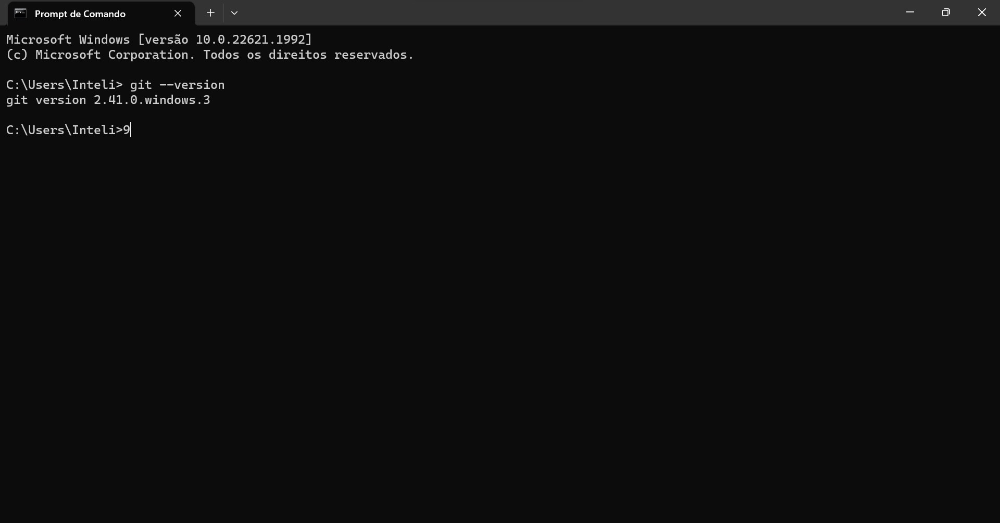
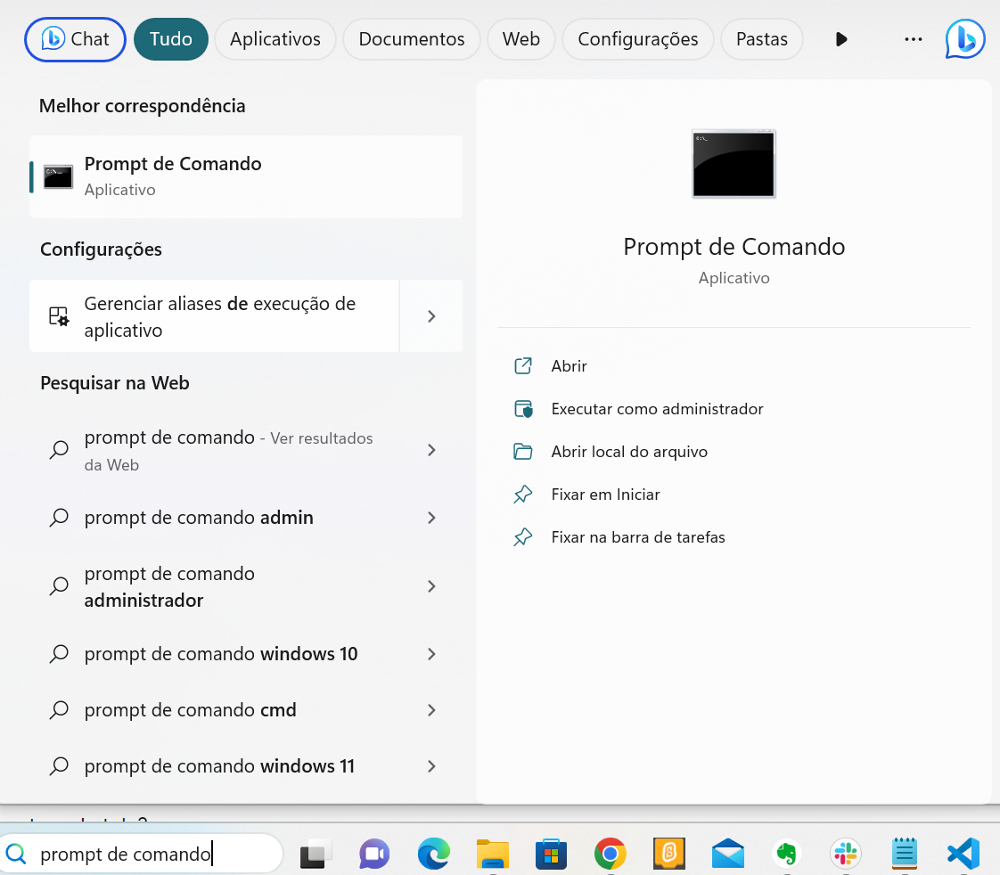
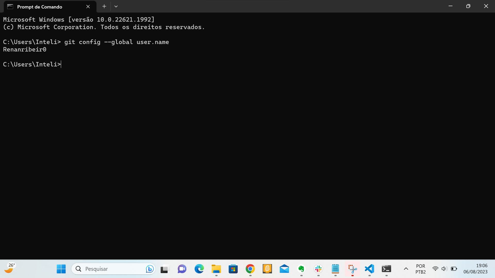

# Usando o Git como linha de comando:

1: Para começar a usar o Git, primeiro vamos abrir nosso shell de comando (Prompt de Comando).
No meu caso que estou usando o sistema windows, irei Git bash. Que vem incluído no Git para Windows.

2: Verificando se o Git esta instalado corretamente.

!C:\Users\Inteli\Documents\M5 atv programacao\relatoriotecnico2\image.png

obs: no meu caso, não havia o git instalado no meu computador, então foi necessário a instalação através do link para instalação em sistema windows: https://git-scm.com/downloads

# Configurando o Git:

adicionando meu nome de usuário:

Para adionar o nome de usuáio, usamos o comando:

